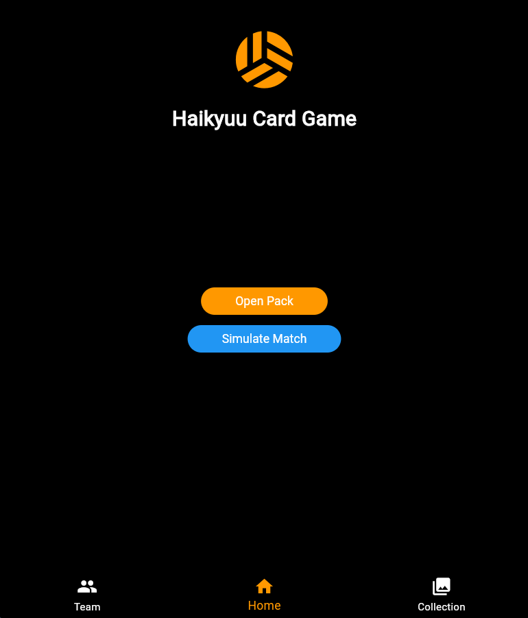

# Haikyuu Card Game

A strategic card collection game inspired by the popular anime *Haikyuu!!*. Build your ultimate volleyball team by collecting player cards, manage your roster, and challenge opponents in exciting match simulations!

---

### Home Screen

*Open booster packs to collect new players and simulate matches to test your team strength.*

### Team Building

*Strategically select your best 7 players to form your competitive team.*

### Card Collection

*Browse and organize your entire card collection across different rarity levels.*

---

## Features

- **Card Collection System**: Collect cards from various Haikyuu teams (Karasuno, Nekoma, Shiratorizawa, and more)
- **Rarity Tiers**: Common, Rare, Epic, and Legendary cards with different power levels
- **Team Building**: Build teams of up to 7 players with strategic card selection
- **Match Simulation**: Simulate volleyball matches where your team's combined strength determines your win probability
- **Responsive Design**: Beautiful UI that adapts to different screen sizes
- **Dynamic Scoring**: Matches play until 25 points (official volleyball scoring)

---

## How to Play

1. **Collect Cards**: Tap "Open Pack" to pull random cards (5 cards per pack)
2. **Build Your Team**: Navigate to the Team screen and select your best 7 players
3. **Simulate Matches**: Return to Home and tap "Simulate Match" to challenge an opponent
4. **Win Strategy**: Teams with higher stat totals have better chances of winning each rally
5. **Expand Collection**: Keep opening packs to find rarer, more powerful players

---

## Project Structure

```
lib/
├── main.dart                 # App entry point
├── models/
│   └── card.dart            # CardModel and all player cards
├── providers/
│   ├── game_providers.dart   # GameState and InheritedNotifier
│   └── match_simulator.dart  # Match logic and simulation
├── screens/
│   ├── home_screen.dart      # Home with pack opening & match sim
│   ├── team_screen.dart      # Team building interface
│   ├── collection_screen.dart # View all cards
│   └── pack_screen.dart      # Pack opening animation/display
└── widgets/
    └── card_widget.dart      # Reusable card display widget
```

---

## Getting Started

### Prerequisites
- Flutter SDK (3.10.0 or higher)
- Dart 3.10.0 or higher

### Installation

1. **Clone the repository**
   ```bash
   git clone https://github.com/yourusername/haikyuu_game.git
   cd haikyuu_game
   ```

2. **Install dependencies**
   ```bash
   flutter pub get
   ```

3. **Run the app**
   ```bash
   flutter run
   ```

---

## Card Stats

Each player card includes 6 key stats:
- **Power (Pwr)**: Attack strength
- **Speed (Spd)**: Movement and reaction speed
- **Technique (Tech)**: Skill precision
- **Stamina (Sta)**: Endurance during matches
- **Defense (Def)**: Blocking and receiving ability
- **Agility (Agi)**: Flexibility and court coverage

---

## Game Mechanics

### Team Strength Calculation
Your team's average stats are used to determine win probability:
- Higher average stats = Higher chance to win each rally
- First to 25 points wins the match
- More balanced teams perform better overall

### Card Rarity Rates
- **Common**: 80% chance
- **Rare**: 15% chance
- **Epic**: 4.5% chance
- **Legendary**: 0.5% chance

---

## 🔧 Technology Stack

- **Framework**: Flutter
- **State Management**: InheritedNotifier + ChangeNotifier
- **Language**: Dart
- **UI Components**: Material Design 3

---

## License

This project is licensed under the MIT License - see the [LICENSE](LICENSE) file for details.

---

## Acknowledgments

- Inspired by *Haikyuu!!* anime and manga
- Built for educational purposes as a Flutter learning project
- Special thanks to the Flutter community

---

## Support

For issues, feature requests, or suggestions, please open an issue on GitHub or contact the developer.

**Happy collecting! Go Karasuno!**

